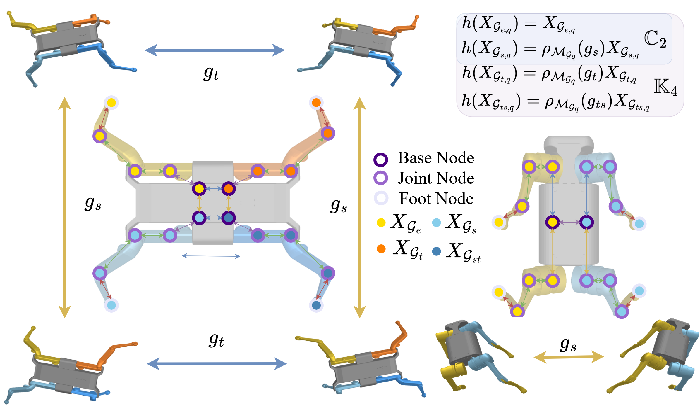

# MS-HGNN for robotic dynamics learning
This repository implements a Morphological-Symmetry-Equivariant Heterogeneous Graph Neural Network for Robotic Dynamics Learning (MS-HGNN) for robotic dynamics learning, that integrates robotic kinematic structures and morphological symmetries into a single graph network.



For information on our method, see our [project page](https://lunarlab-gatech.github.io/MorphSym-HGNN/) and [paper](https://arxiv.org/abs/2412.01297).

## Installation
To get started, setup a Conda Python environment with Python=3.11:
```
conda create -n ms-hgnn python=3.11
conda activate ms-hgnn
```

Then, install the library (and dependencies) with the following command:
```
cd MorphSym-HGNN
pip install .
```

Note, if you have any issues with setup, refer to `environment_files/README.md` so you can install the exact libraries we used.

## URDF Download
The necessary URDF files are part of git submodules in this repository, so run the following commands to download them:
```
git submodule init
git submodule update
```

## Replicating Paper Experiments

To replicate the experiments referenced in our paper or access our trained model weights, see `paper/README.md`.

## Acknowledgements

We would like to thank [Daniel Chase Butterfield](https://scholar.google.com/citations?user=i5PF63IAAAAJ&hl=en) for the awesome work on the original implementation of the [Morphology-Informed-HGNN](https://github.com/lunarlab-gatech/Morphology-Informed-HGNN). And thank [Lingjun Zhao](https://scholar.google.com/citations?user=iyNynZwAAAAJ&hl=en) for the helpful discussions on the implementation of the code.

## Citation

If you find our repository or our work useful, please cite the relevant publication:

```
@misc{xie2024morphologicalsymmetryequivariantheterogeneousgraphneural,
      title={Morphological-Symmetry-Equivariant Heterogeneous Graph Neural Network for Robotic Dynamics Learning}, 
      author={Fengze Xie and Sizhe Wei and Yue Song and Yisong Yue and Lu Gan},
      year={2024},
      eprint={2412.01297},
      archivePrefix={arXiv},
      primaryClass={cs.RO},
      url={https://arxiv.org/abs/2412.01297}, 
}
```

## TODO
- [ ] Code optimization
- [ ] Support Solo-12 dataset more smoothly


## Contact / Issues

For any issues with this repository, feel free to open an issue on GitHub. For other inquiries, please contact Fengze Xie (fxxie@caltech.edu), Sizhe Wei (swei@gatech.edu), or the Lunar Lab (https://sites.gatech.edu/lunarlab/).
