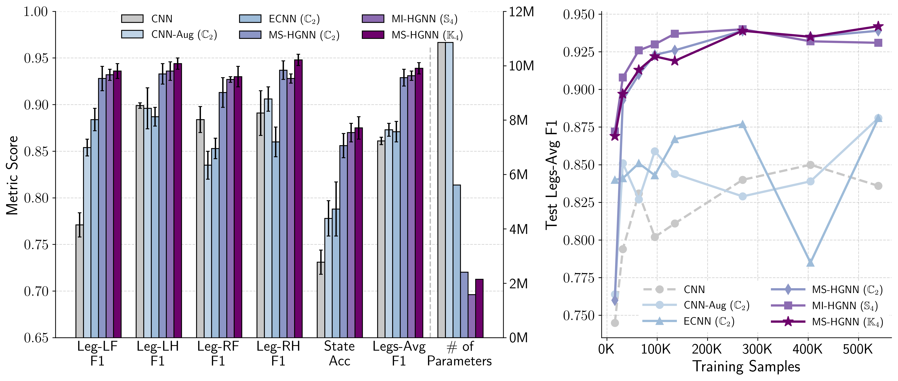

# Paper Replication

This directory provides information on replicating experiments in the [Morphological-Symmetry-Equivariant Heterogeneous Graph Neural Network for Robotic Dynamics Learning](https://arxiv.org/pdf/2412.01297) paper. It includes model weights, links to other necessary repositories, and instructions for generating figures.

Whenever a specific trained model is referenced in this README (for example, `ancient-salad-5`), it will be highlighted as shown, and there will be a folder on Georgia Tech's [Dropbox](https://www.dropbox.com/scl/fo/jr4792clrd3f075obxg1f/ABWSPzN5igR-znx55pOijIY?rlkey=yw7741ybrfgucf8rmsl5l34rf&st=xt2tfjfd&dl=0) with its name. Unless otherwise specified, the model weights used for the paper were those trained the longest (have highest `epoch=` number in their .ckpt file).

```bash
mkdir ckpts && cd ckpts
wget -O 'ckpts.zip' [dropbox_link]
mkdir 'Classification Experiment' && mkdir 'Regression Experiment'
unzip 'ckpts.zip' -d 'ckpts'
rm 'ckpts.zip'
rm wget-log*
cd ..
```

## Contact Detection (Classification) Experiment
### Files for Training and Evaluating MS-HGNN
For training and evaluating models on this classification task, use the following .py files in the `research` directory of this repository for training and evaluating MS-HGNN:
- MS-HGNN:
  - `train_classification_msgn.py`: for training MS-HGNN
  - `train_classification_sample_eff_msgn.py`: for training MS-HGNN for the sample efficiency experiment
  - `evaluator_classification_k4.py`: for evaluating MS-HGNN, can be used for both K4 and C2
- Baseline models:
  - `train_classification.py`: for training MI-HGNN
  - `evaluator_classification.py`: for evaluating MI-HGNN
  - `evaluator_classification_s4.py`: for verifying MI-HGNN following the S4 property
  - `train_classification_sample_eff.py`: for training MI-HGNN for the sample efficiency experiment

### Commands for Training and Evaluating MS-HGNN
**Training Examples**
```bash
python research/train_classification_msgn.py\
    --seed 2\
    --logger_project_name msgn_cls_k4\
    --model_type heterogeneous_gnn_k4\
    --symmetry_mode MorphSym\
    --group_operator_path cfg/mini_cheetah-k4.yaml

python research/train_classification_msgn.py\
    --seed 2\
    --logger_project_name msgn_cls_c2\
    --model_type heterogeneous_gnn_c2\
    --symmetry_mode MorphSym\
    --group_operator_path cfg/mini_cheetah-c2.yaml

python research/train_classification_msgn.py\
    --seed 2\
    --logger_project_name msgn_cls_k4\
    --model_type heterogeneous_gnn_k4\
    --symmetry_mode MorphSym\
    --group_operator_path cfg/mini_cheetah-k4.yaml\
    --sample_ratio 0.45

python research/train_classification_msgn.py\
    --seed 2\
    --logger_project_name msgn_cls_c2\
    --model_type heterogeneous_gnn_c2\
    --symmetry_mode MorphSym\
    --group_operator_path cfg/mini_cheetah-c2.yaml\
    --sample_ratio 0.45
```
**Testing Examples**
```bash
python research/evaluator_classification_k4.py\
    --MorphSym_version K4\
    --symmetry_mode MorphSym\
    --group_operator_path cfg/mini_cheetah-k4.yaml\
    --path_to_checkpoint [PATH_TO_CHECKPOINT]

python research/evaluator_classification_k4.py\
    --MorphSym_version C2\
    --group_operator_path cfg/mini_cheetah-c2.yaml\
    --symmetry_mode MorphSym\
    --path_to_checkpoint [PATH_TO_CHECKPOINT]
```
For the results of baseline models, see the repos:
- [Morphology-Informed-HGNN](https://github.com/lunarlab-gatech/Morphology-Informed-HGNN) for MI-HGNN
- [MorphoSymm-Replication](https://github.com/lunarlab-gatech/MorphoSymm-Replication) for CNN, CNN-Aug, ECNN

### Checkpoint Models and Results
Our MS-HGNN models trained during this experiment can be found in the table below. For more details, see the `contact_experiment.csv` file in this directory. 
#### MS-HGNN (K4)
| **Batch Size** | **Hidden Size** | **Seed** |   **Module Name**   | **State Accuracy (Test)** | **Legs-Avg F1** |
|:--------------:|:---------------:|:--------:|:-------------------:|:-------------------------:|:---------------:|
|       64       |       128       |     0    |    comic-night-11   |         0.86259830        |    0.93121755   |
|       64       |       128       |     5    | glamorous-meadow-10 |         0.87613565        |    0.93821277   |
|       30       |       128       |    42    |    comfy-shape-20   |         0.89072168        |    0.94599206   |
|       64       |       128       |   3407   |     avid-moon-13    |         0.86968952        |    0.94219799   |

#### MS-HGNN (C2)
| **Batch Size** | **Hidden Size** | **Seed** | **Module Name** | **State Accuracy (Test)** | **Legs-Avg F1** |
|:--------------:|:---------------:|:--------:|:---------------:|:-------------------------:|:---------------:|
|       64       |       128       |     0    |   jolly-tree-2  |         0.84823000        |    0.92280016   |
|       64       |       128       |     5    |  silver-night-6 |         0.84255379        |    0.91976107   |
|       64       |       128       |    42    | morning-sound-8 |         0.86321157        |    0.93490676   |
|       64       |       128       |   3407   | fearless-bush-9 |         0.87154531        |    0.93881258   |

#### MS-HGNN (K4) Sample Efficiency
All of the models are trained with the same hyperparameters, so the only difference is the training sample ratio. Batch_size is 64, hidden_size is 128, and seed is 3407.

|   **Module Name**  | **Training Sample Ratio** | **Avg-Leg F1** |
|:-----------------:|:-------------------------:|:--------------:|
|   zesty-water-5   |            0.025          |      0.869     |
|  clean-aardvark-7 |            0.05           |      0.897     |
| effortless-dawn-6 |            0.1            |      0.913     |
| dainty-universe-1 |            0.15           |      0.922     |
| worthy-mountain-4 |           0.2125          |      0.919     |
| vague-waterfall-2 |           0.425           |      0.939     |
|   trim-planet-3   |           0.6375          |      0.935     |
|    avid-moon-13   |            0.85           |      0.942     |


#### MS-HGNN (C2) Sample Efficiency
All of the models are trained with the same hyperparameters, so the only difference is the training sample ratio. Batch_size is 64, hidden_size is 128, and seed is 3407.

| **Module Name** | **Training Sample Ratio** | **Avg-Leg F1** |
|:---------------:|:-------------------------:|:--------------:|
| summer-donkey-9 |            0.025          |      0.760     |
| breezy-monkey-1 |            0.05           |      0.893     |
|   azure-sun-4   |            0.1            |      0.910     |
|  elated-bird-5  |            0.15           |      0.923     |
|  noble-galaxy-6 |           0.2125          |      0.926     |
|  bright-tree-3  |           0.425           |      0.939     |
|  autumn-oath-2  |           0.6375          |      0.935     |
| fearless-bush-9 |            0.85           |      0.939     |

## Ground Reaction Force Estimation (Regression) Experiment 
### Files for Training and Evaluating MS-HGNN (C2)
For training and evaluating models on this regression task, use the following .py files in the `research` directory of this repository for training and evaluating MS-HGNN:
- MS-HGNN:
  - `train_regression-grf_msgn.py`: for training MS-HGNN
  - `evaluator_regression-grf_c2.py`: for evaluating MS-HGNN
- Baseline models:
  - `train_regression-grf.py`: for training MI-HGNN
  - `evaluator_regression-grf.py`: for evaluating MI-HGNN



### Commands for Training and Evaluating MS-HGNN (C2)
**Training Examples**
```bash
# 3D GRF
python research/train_regression-grf_msgn.py\
    --seed 3407\
    --logger_project_name msgn_grf_c2_d=3\
    --grf_body_to_world_frame True\
    --grf_dimension 3
   
# 1D GRF (z-axis)
python research/train_regression-grf_msgn.py\
    --seed 3407\
    --logger_project_name msgn_grf_c2_d=1\
    --grf_dimension 1
```
**Testing Examples**
```bash
# d=3
python research/evaluator_regression-grf_c2.py\
    --path_to_checkpoint [PATH_TO_CHECKPOINT]\
    --grf_body_to_world_frame 1\
    --grf_dimension 3

# d=1
python research/evaluator_regression-grf_c2.py\
    --path_to_checkpoint [PATH_TO_CHECKPOINT]\
    --test_only_on_z 1\
    --grf_dimension 1
```

### Checkpoint Models and Results
#### MS-HGNN (C2) (3D GRF) and Baseline (MI-HGNN)
All of the models are trained with the same hyperparameters, so the only difference is the seed. Batch_size is 64, hidden_size is 128. Results are caculated with root mean squared error (RMSE).

**MS-HGNN (C2) (3D GRF)**
| **Seed** |    **Module Name**   | **Unseen Friction** | **Unseen Speed** | **Unseen Terrain** | **Unseen All** |  **Total** |
|:--------:|:--------------------:|:-------------------:|:----------------:|:------------------:|:--------------:|:----------:|
|     0    |     atomic-haze-1    |      6.32735555     |    7.65134468    |     7.17977061     |   8.53970181   | 7.22131269 |
|    10    | treasured-universe-3 |      6.32653381     |    7.75987258    |     7.23529034     |   8.55396699   | 7.27300841 |
|    42    |    helpful-gorge-6   |      6.33611576     |    7.73401231    |     7.26039316     |   8.71687377   | 7.29523419 |
|   3407   |    glowing-snow-7    |      6.42951437     |    7.74001567    |     7.15844559     |    8.7108045   | 7.28281504 |

**MI-HGNN (C2) (3D GRF)**
| **Seed** |    **Module Name**   | **Unseen Friction** | **Unseen Speed** | **Unseen Terrain** | **Unseen All** |  **Total** |
|:--------:|:--------------------:|:-------------------:|:----------------:|:------------------:|:--------------:|:----------:|
|     0    |    rose-firefly-1    |      6.35884186     |    7.80886478    |     7.22587749     |   8.67109055   | 7.30427836 |
|    10    |   denim-elevator-5   |      6.4380547      |    7.89594016    |     7.39217265     |   8.69735545   | 7.41076572 |
|    42    | celestial-darkness-6 |      6.48433247     |    7.96542475    |     7.33168889     |   8.68058906   | 7.41812726 |
|   3407   |     true-forest-7    |      6.46478239     |    7.87804687    |     7.38007744     |   8.78454428   | 7.41757872 |

#### MS-HGNN (C2) (1D GRF)
All of the models are trained with the same hyperparameters, so the only difference is the seed. Batch_size is 64, hidden_size is 128. Results are caculated with root mean squared error (RMSE).
> Note: There are two models for seed 0, 10, 3407. The reason is the model training process was killed by the system, so we retrained (continued training) the model with the same hyperparameters.

| **Seed** |           **Module Name**          | **Unseen Friction** | **Unseen Speed** | **Unseen Terrain** | **Unseen All** |  **Total** |
|:--------:|:----------------------------------:|:-------------------:|:----------------:|:------------------:|:--------------:|:----------:|
|     0    |   devout-sea-5 -> olive-vortex-6   |      7.96614777     |     9.777163     |     8.73075152     |   10.0367891   | 8.94538854 |
|    10    | astral-flower-4 -> hopeful-water-7 |      8.2155633      |    9.94217943    |     9.03350186     |   10.4336334   | 9.20425164 |
|    42    |           serene-voice-2           |      8.07836671     |    9.74751079    |      8.7271707     |   10.2032946   | 8.98152898 |
|   3407   |    peachy-cloud-3 -> rich-tree-8   |      8.09591778     |    9.68049382    |     8.81388802     |   10.3072839   | 9.00860565 |

