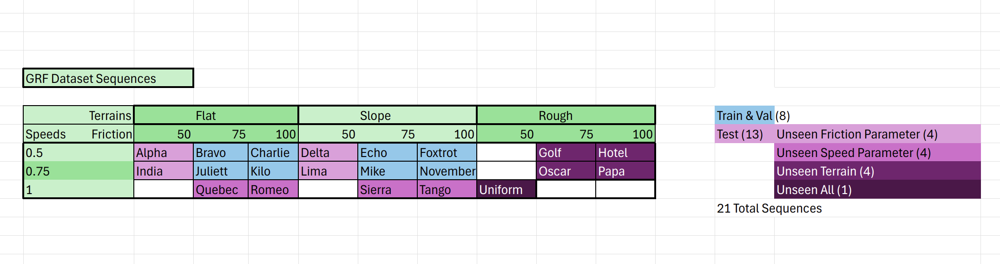
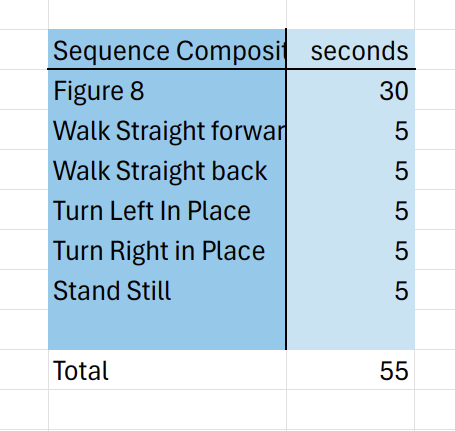

# Paper Replication

This directory provides information on replicating experiments in the [Morphological-Symmetry-Equivariant Heterogeneous Graph Neural Network for Robotic Dynamics Learning](https://arxiv.org/pdf/2412.01297) paper. It includes model weights, links to other necessary repositories, and instructions for generating figures.

Whenever a specific trained model is referenced in this README (for example, `ancient-salad-5`), it will be highlighted as shown, and there will be a folder on Georgia Tech's [Dropbox]() with its name. Unless otherwise specified, the model weights used for the paper were those trained the longest (have highest `epoch=` number in their .ckpt file).

```bash
mkdir ckpts && cd ckpts
wget -O 'Classification Experiment.zip' [dropbox_link]
wget -O 'Regression Experiment.zip' [dropbox_link]
mkdir 'Classification Experiment' && mkdir 'Regression Experiment'
unzip 'Classification Experiment.zip' -d 'Classification Experiment'
unzip 'Regression Experiment.zip' -d 'Regression Experiment'
rm 'Classification Experiment.zip' && rm 'Regression Experiment.zip'
rm wget-log*
cd ..
```

## Contact Detection (Classification) Experiment
### Files for Training and Evaluating MS-HGNN
For training and evaluating models on this classification task, use the following .py files in the `research` directory of this repository for training and evaluating MS-HGNN:
- MS-HGNN:
  - `train_classification_msgn.py`: for training MS-HGNN
  - `train_classification_sample_eff_msgn.py`: for training MS-HGNN for the sample efficiency experiment
  - `evaluator_classification_k4.py`: for evaluating MS-HGNN, can be used for both K4 and C2
- Baseline models:
  - `train_classification.py`: for training MI-HGNN
  - `evaluator_classification.py`: for evaluating MI-HGNN
  - `evaluator_classification_s4.py`: for verifying MI-HGNN following the S4 property
  - `train_classification_sample_eff.py`: for training MI-HGNN for the sample efficiency experiment

### Commands for Training and Evaluating MS-HGNN
**Training Examples**
```bash
python research/train_classification_msgn.py\
    --seed 2\
    --logger_project_name msgn_cls_k4\
    --model_type heterogeneous_gnn_k4\
    --symmetry_mode MorphSym\
    --group_operator_path cfg/mini_cheetah-k4.yaml

python research/train_classification_msgn.py\
    --seed 2\
    --logger_project_name msgn_cls_c2\
    --model_type heterogeneous_gnn_c2\
    --symmetry_mode MorphSym\
    --group_operator_path cfg/mini_cheetah-c2.yaml

python research/train_classification_msgn.py\
    --seed 2\
    --logger_project_name msgn_cls_k4\
    --model_type heterogeneous_gnn_k4\
    --symmetry_mode MorphSym\
    --group_operator_path cfg/mini_cheetah-k4.yaml\
    --sample_ratio 0.45

python research/train_classification_msgn.py\
    --seed 2\
    --logger_project_name msgn_cls_c2\
    --model_type heterogeneous_gnn_c2\
    --symmetry_mode MorphSym\
    --group_operator_path cfg/mini_cheetah-c2.yaml\
    --sample_ratio 0.45
```
**Testing Examples**
```bash
python research/evaluator_classification_k4.py\
    --MorphSym_version K4\
    --symmetry_mode MorphSym\
    --group_operator_path cfg/mini_cheetah-k4.yaml\
    --path_to_checkpoint [PATH_TO_CHECKPOINT]

python research/evaluator_classification_k4.py\
    --MorphSym_version C2\
    --group_operator_path cfg/mini_cheetah-c2.yaml\
    --symmetry_mode MorphSym\
    --path_to_checkpoint [PATH_TO_CHECKPOINT]
```
For the results of baseline models, see the repos:
- [Morphology-Informed-HGNN](https://github.com/lunarlab-gatech/Morphology-Informed-HGNN) for MI-HGNN
- [MorphoSymm-Replication](https://github.com/lunarlab-gatech/MorphoSymm-Replication) for CNN, CNN-Aug, ECNN

### Checkpoint Models and Results
Our MS-HGNN models trained during this experiment can be found in the table below. For more details, see the `contact_experiment.csv` file in this directory. 
#### MS-HGNN (K4)
| **Batch Size** | **Hidden Size** | **Seed** |   **Module Name**   | **State Accuracy (Test)** | **Legs-Avg F1** |
|:--------------:|:---------------:|:--------:|:-------------------:|:-------------------------:|:---------------:|
|       64       |       128       |     0    |    comic-night-11   |         0.86259830        |    0.93121755   |
|       64       |       128       |     5    | glamorous-meadow-10 |         0.87613565        |    0.93821277   |
|       30       |       128       |    42    |    comfy-shape-20   |         0.89072168        |    0.94599206   |
|       64       |       128       |   3407   |     avid-moon-13    |         0.86968952        |    0.94219799   |

#### MS-HGNN (C2)
| **Batch Size** | **Hidden Size** | **Seed** | **Module Name** | **State Accuracy (Test)** | **Legs-Avg F1** |
|:--------------:|:---------------:|:--------:|:---------------:|:-------------------------:|:---------------:|
|       64       |       128       |     0    |   jolly-tree-2  |         0.84823000        |    0.92280016   |
|       64       |       128       |     5    |  silver-night-6 |         0.84255379        |    0.91976107   |
|       64       |       128       |    42    | morning-sound-8 |         0.86321157        |    0.93490676   |
|       64       |       128       |   3407   | fearless-bush-9 |         0.87154531        |    0.93881258   |

#### MS-HGNN (K4) Sample Efficiency
All of the models are trained with the same hyperparameters, so the only difference is the training sample ratio. Batch_size is 64, hidden_size is 128, and seed is 3407.

|   **model name**  | **training sample ratio** | **Avg-Leg F1** |
|:-----------------:|:-------------------------:|:--------------:|
|   zesty-water-5   |           0.0025          |      0.869     |
|  clean-aardvark-7 |            0.05           |      0.897     |
| effortless-dawn-6 |            0.1            |      0.913     |
| dainty-universe-1 |            0.15           |      0.922     |
| worthy-mountain-4 |           0.2125          |      0.919     |
| vague-waterfall-2 |           0.425           |      0.939     |
|   trim-planet-3   |           0.6375          |      0.935     |
|    avid-moon-13   |            0.85           |      0.942     |


#### MS-HGNN (C2) Sample Efficiency
All of the models are trained with the same hyperparameters, so the only difference is the training sample ratio. Batch_size is 64, hidden_size is 128, and seed is 3407.

|  **model name** | **training sample ratio** | **Avg-Leg F1** |
|:---------------:|:-------------------------:|:--------------:|
| summer-donkey-9 |           0.0025          |      0.760     |
| breezy-monkey-1 |            0.05           |      0.893     |
|   azure-sun-4   |            0.1            |      0.910     |
|  elated-bird-5  |            0.15           |      0.923     |
|  noble-galaxy-6 |           0.2125          |      0.926     |
|  bright-tree-3  |           0.425           |      0.939     |
|  autumn-oath-2  |           0.6375          |      0.935     |
| fearless-bush-9 |            0.85           |      0.939     |


The baseline models we compared to (ECNN, CNN-aug, CNN) were trained on this release: [MorphoSymm-Replication - Contact Detection](https://github.com/lunarlab-gatech/MorphoSymm-Replication/releases/tag/RepFigure3(a)). See that repository for information on accessing those model weights and generating Figure 3 (a).

### Sample Efficiency Evaluation

For training models for the sample efficiency experiment, use the `train_classification_sample_eff.py` file.

Our MI-HGNN models trained for the sample efficiency figure can be found below. For more details, see the `contact_experiment_sample_eff.csv` file in this directory.

| Training Percentage (%) | Model Name              |
| ----------------------- | ----------------------- |
|                  0.025  | `twilight-pond-9`       |
|                  0.05   | `iconic-serenity-7`     |
|                  0.1    | `daily-pine-6`          |
|                  0.15   | `dry-wood-8`            |
|                  0.2125 | `efficient-shadow-3`    |
|                  0.425  | `smart-waterfall-2`     |
|                  0.6375 | `treasured-moon-4`      |
|                  0.85   | `atomic-waterfall-5`    |

The baseline models we compared to (ECNN, CNN-aug, CNN) were trained on this release: [MorphoSymm-Replication - Contact Detection Sample Efficiency](https://github.com/lunarlab-gatech/MorphoSymm-Replication/releases/tag/RepFigure3(b)). See that repository for information on accessing those model weights and generating Figure 3 (b).

### Abalation Study

We conducted an abalation study to see how the model parameters affected performance, as shown in Table II in the paper. Here those values are associated with the model's name in the table below. For more details, including test accuracies, see the `contact_experiment_ablation.csv` file in this directory.

| Number of Layers | Hidden Sizes | Model Name             |
| ---------------- | ------------ | ---------------------- |
| 4                | 5            | `prime-water-16`       |
| 4                | 10           | `driven-shape-17`      |
| 4                | 25           | `autumn-terrain-18`    |
| 4                | 50           | `comfy-dawn-19`        |
| 4                | 128          | `prime-butterfly-20`   |
| 4                | 256          | `youthful-galaxy-21`   |
| 8                | 50           | `exalted-mountain-22`  |
| 8                | 128          | `serene-armadillo-23`  |
| 8                | 256          | `playful-durian-12`    |
| 12               | 50           | `twilight-armadillo-15`|
| 12               | 128          | `sparkling-music-14`   |
| 12               | 256          | `stoic-mountain-13`    |


## Ground Reaction Force Estimation (Regression) Experiment 

For training and evaluating models on this regression task, use the `train_regression.py` and `evaluator_regression.py` files found in the `research` directory of this repository. Note that for the floating base dynamics (FBD) model, there is no training involved, and the `evaluator_regression_dynamics.py` file should be used instead.

All of the models trained for this experiment can be found in the table below:

| Model Type | Model Name              |
| ---------- | ----------------------- |
|        MLP | `clear-haze-11`         |
|        MLP | `cosmic-water-19`       |
|        MLP | `dauntless-surf-15`     |
|        MLP | `fast-hill-18`          |
|        MLP | `gentle-thunder-16`     |
|        MLP | `icy-gorge-12`          |
|        MLP | `noble-dust-14`         |
|        MLP | `restful-meadow-13`     |
|    MI-HGNN | `amber-waterfall-25`    |
|    MI-HGNN | `faithful-elevator-27`  |
|    MI-HGNN | `feasible-valley-22`    |
|    MI-HGNN | `hopeful-rain-21`       |
|    MI-HGNN | `rare-sun-17`           |
|    MI-HGNN | `smooth-galaxy-20`      |
|    MI-HGNN | `twilight-bush-24`      |
|    MI-HGNN | `wise-firebrand-23`     |

After running the evaluation files, the data used to generate Table III can be found in the generated .csv files. Our generated .csv files are stored in this directory, and are named as follows:

- `regression_results_dynamics.csv`
- `regression_results_hgnns.csv`
- `regression_results_mlps.csv`

For the standard deviation, we calculated the "corrected sample standard deviation". For more details, see [LibreOffice Documentation](https://wiki.documentfoundation.org/Documentation/Calc_Functions/STDEV.S).

Finally, Figure 5 is generated by running the `create_regression_plots.py` file, and is saved as `regression_evaluation.png`. The visualization of Figure 5 and Pinocchio visualization used in the MI-HGNN ICRA submission video is created by running `create_regression_plot_video.py`.

### GRF Quad-SDK Dataset

For this experiment, we used a dataset that we generated ourselves using Quad-SDK and Gazebo. Our modified fork that we used can be found here: [quad-sdk-fork](https://github.com/lunarlab-gatech/quad_sdk_fork). We generated a total of 21 sequences. The following table relates the dataset sequence name (in code) to the corresponding parameters used for that sequence:



In each sequence, the operator loosely followed the high-level control instructions and timings seen below:



